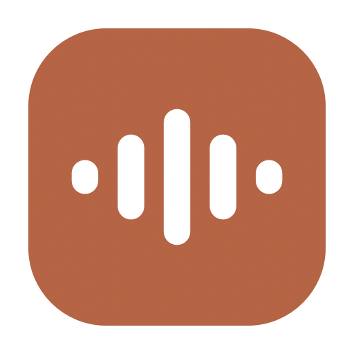

<div align="center">

# Dictate

**Speak. It types.**

Lightning-fast voice-to-text for macOS. Press a hotkey, speak, and your words appear wherever you're typing — Slack, Chrome, VS Code, Notes, anywhere.



</div>

---

> [!NOTE]
> **This project is not actively maintained.** I built Dictate for myself and use it daily — it works, but it has rough edges and I'm not managing issues, fixing bugs, or reviewing pull requests. It's shared as-is, for free, under the MIT license. Fork it and make it your own. 🙂

Dictate is a tiny macOS menu bar app. Hold **Right Option + Space**, talk, let go, and your transcribed text is pasted into whatever app you're in. Transcription runs on [Groq's](https://groq.com) Whisper API, so words usually appear in under a second.

It's **bring-your-own-key (BYOK)** — you use your own free Groq API key, so your audio goes straight from your Mac to Groq and nowhere else. No account, no server, no subscription.

## Install — what you actually do

You don't need to build anything or touch a terminal. Three steps:

1. **[Download Dictate.zip](https://github.com/oliwoodman/Dictation/releases/latest/download/Dictate.zip)** (from the [latest release](https://github.com/oliwoodman/Dictation/releases/latest)).
2. **Unzip it** (double-click) and **drag `Dictate.app` into your Applications folder**.
3. **Open it.** macOS will ask once *"Dictate was downloaded from the Internet — open it?"* → click **Open**.

That's it. The app is signed and notarized by Apple, so there's no "unidentified developer" warning. From here, a setup wizard takes over.

### The setup wizard (first launch)

When you first open Dictate it walks you through everything:

1. **Welcome**
2. **Permissions** — it opens the right System Settings panes so you can switch on **Microphone** and **Accessibility** (macOS requires these for any app that listens and types for you — there's no way around it).
3. **API key** — paste your free Groq key (see below).
4. **Done** — you're ready.

Then just hold **Right Option + Space**, speak, and let go. Your words paste wherever your cursor is.

> **Tip:** You can have an AI assistant do the whole download-and-setup for you. See [Set it up with AI](#set-it-up-with-ai) below.

## Getting a free Groq API key

Dictate needs a Groq API key to transcribe (it's free):

1. Go to [console.groq.com/keys](https://console.groq.com/keys).
2. Sign up / log in.
3. Click **Create API Key** and copy it (it starts with `gsk_...`).
4. Paste it into Dictate's setup wizard.

Groq's free tier comfortably covers everyday dictation. Your key is stored **only** on your Mac, at `~/Library/Application Support/Dictate/config.json`, and is only ever sent to Groq.

## Set it up with AI

Paste this into an AI assistant that can run commands on your Mac (e.g. Claude Code, or any agent with terminal access) and it'll do the install for you:

```
Download and set up the Dictate app on my Mac:
1. Download https://github.com/oliwoodman/Dictation/releases/latest/download/Dictate.zip
2. Unzip it and move Dictate.app into /Applications
3. Open it
4. Then walk me through the first-run wizard: I'll grant Microphone and
   Accessibility permissions when it opens System Settings, and I'll paste a
   free Groq API key from https://console.groq.com/keys
It's signed and notarized by Apple. To use it after setup I hold
Right Option + Space, speak, and let go.
```

## Uninstall

```bash
rm -rf /Applications/Dictate.app
rm -rf ~/Library/Application\ Support/Dictate    # removes your saved API key too
```

Then in **System Settings → Privacy & Security**, remove Dictate from **Microphone** and **Accessibility**.

> Note: deleting only `Dictate.app` leaves your key behind in Application Support — which is why a reinstall "just works" without asking again. Remove the folder above for a clean slate.

---

## For developers — build from source

> Most people don't need this. If you just want to use Dictate, download it above.

It's a single Swift file compiled with `swiftc` — no Xcode project.

```bash
git clone https://github.com/oliwoodman/Dictation.git
cd Dictation
./build.sh
open Dictate.app
```

`./build.sh` with no extra settings produces an **unsigned local build** — it runs fine on *your own* Mac (you may need to right-click → Open the first time, since it isn't notarized). That's expected and only affects you building it yourself.

To produce a **signed + notarized** build for distributing to others (this is what the official release download is), supply your Apple developer credentials:

```bash
SIGN_IDENTITY="Developer ID Application: Your Name (TEAMID)" \
APPLE_ID="you@example.com" \
TEAM_ID="YOURTEAMID" \
APP_PASSWORD="your-app-specific-password" \
./build.sh
```

**Requirements:** macOS 12.0+, Xcode Command Line Tools (`xcode-select --install`).

### How it works

Single-file Swift app ([`dictation.swift`](dictation.swift)) using Cocoa, AVFoundation, and Carbon:

- **DictationController** — recording + transcription. Captures audio with `AVAudioEngine`, sends it to Groq, pastes the result via `CGEvent`.
- **DictationPanel / WaveformView** — the floating recording UI with a real-time waveform.
- **OnboardingWizard** — the first-run setup (permissions + API key).
- **MenuBarManager** — the menu bar item and its menu.

## Privacy

- Audio is sent **only** to Groq for transcription, over HTTPS.
- Your API key never leaves your machine except in requests to Groq.
- No analytics, no telemetry, no accounts.

## License

[MIT](LICENSE) © Oli Woodman — provided as-is, without warranty or support.

---

<div align="center">
Built by <a href="https://instagram.com/buildwitholi">@buildwitholi</a>
</div>
